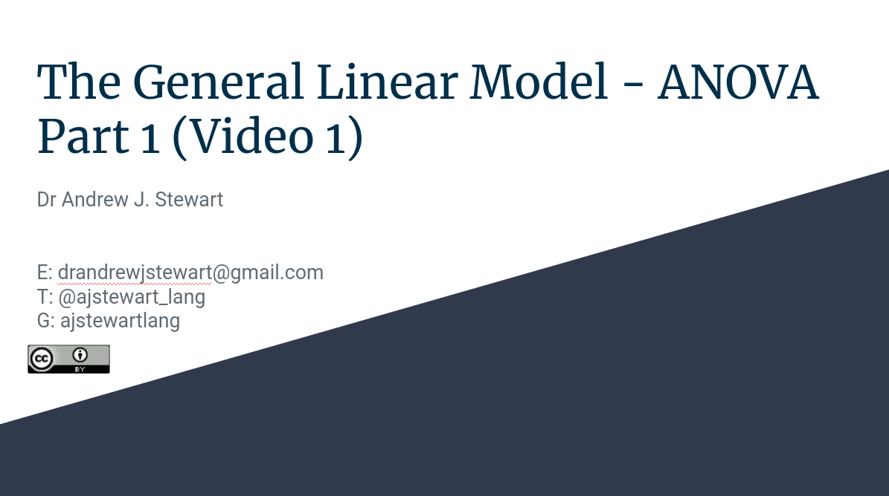
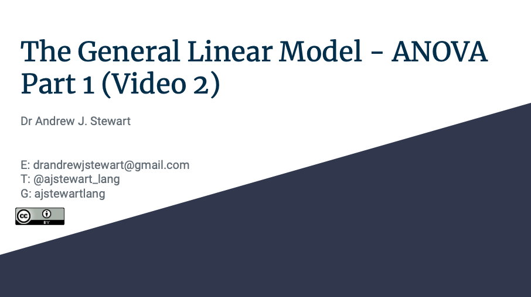

# Overview

In this workshop we will examine how to conduct Analysis of Variance (ANOVA) in R. We will begin by exploring why we tend to use ANOVA (rather than multiple *t*-tests), before moving on to some examples of ANOVA for between participants and repeated measures designs.

&nbsp;&nbsp;

<center>

<iframe width="560" height="315" src="https://youtube.com/embed/vw-BoLFHw2s" frameborder="0" allowfullscreen></iframe>

</center>

&nbsp;&nbsp;

## Slides

If you have a Google account, you can also view and download the slides in a range of formats by clicking on the image below. If you don't have a Google account, you can download the slides in .pdf format by [clicking here](../slides/introduction_to_open_research.pdf).

&nbsp;&nbsp;

<center>

[{width=75%}](https://docs.google.com/presentation/d/1UOkWayJ5J7j2Xg1Y05sbkK-iWtlkAVvtalOu4VuEq4c/edit?usp=sharing)

</center>

&nbsp;&nbsp;

In this second video, I will show you how to build a between participants ANOVA model in R using the `afex::` package.

&nbsp;&nbsp;

<center>

<iframe width="560" height="315" src="https://youtube.com/embed/vw-BoLFHw2s" frameborder="0" allowfullscreen></iframe>

</center>

&nbsp;&nbsp;

## Slides

If you have a Google account, you can also view and download the slides in a range of formats by clicking on the image below. If you don't have a Google account, you can download the slides in .pdf format by [clicking here](../slides/introduction_to_open_research.pdf).

&nbsp;&nbsp;

<center>

[{width=75%}](https://docs.google.com/presentation/d/1UOkWayJ5J7j2Xg1Y05sbkK-iWtlkAVvtalOu4VuEq4c/edit?usp=sharing)

</center>

&nbsp;&nbsp;

After you've watched both of the videos above, it's your turn to build your first ANOVA in R for a between participants design. This is the same data (from the same study) that I covered in the second of the two videos above. Follow the instructions below to build that model.

# Between Participants ANOVA
## Loading our Packages

First of all, we need to load the three packages we will be using - they are `tidyverse`, `afex`, and `emmeans`. The `afex::` package is the one we use for conducting factorial ANOVA. We use the `emmeans` package for running follow-up tests on the ANOVA model that we will be building.

```{r, message=FALSE, warning=FALSE}
library(tidyverse)
library(afex)
library(emmeans)
```

## Reading in our Data

We have 45 participants in a between participants design where we are interested in the effect of beverage consumed on ability on a motor task.  Our experimental factor (beverage type) has 3 levels.  These are Water vs. Single Espresso vs. Double Espresso, and Ability is our DV measured on a continuous scale. Let's read in our data.

```{r, message=FALSE}
my_data <- read_csv("https://raw.githubusercontent.com/ajstewartlang/11_glm_anova_pt1/master/data/cond.csv")
head(my_data)
```

We see that we have three variables, but our experimental variable `Condition` is not coded as a factor. Let's fix that...

```{r}
my_data_tidied <- my_data %>%
  mutate(Condition = factor(Condition))
head(my_data_tidied)
```

## Summary Statistics

Let's work our some summary statistics and build a data visualisation next.

```{r}
my_data_tidied %>%
  group_by(Condition) %>%
  summarise(mean = mean(Ability), sd = sd(Ability))
```

## Visualising our Data

```{r}
set.seed(1234)
my_data_tidied %>% 
  ggplot(aes(x = Condition, y = Ability, colour = Condition)) +
  geom_violin() +
  geom_jitter(width = .1) +
  guides(colour = FALSE) +
  stat_summary(fun.data = "mean_cl_boot", colour = "black") +
  theme(text = element_text(size = 13))
```

We have built a visualisation where we have plotted the raw data points using the `geom_jitter()` function, and the shape of the distribution for each condition using the `geom_violin()` function. We have also added some summary data in the form of the Mean and Confidence Intervals around the Mean using the `stat_summary()` function.

## Building our ANOVA Model

Let's now build our model using the `aov_4()` function in the afex:: package. The syntax for ANOVA models in `aov_4()` is: `aov_4(DV ~ IV + (1 | Participant), data = my_data_tidied)`. The `~` symbol means predicted by, the `(1 | Participant)` term corresponds to our random effect - we obviously can't test all the participants in the world so have taken just a random sample from this population. Finally, we need to specify what dataset we are using by making that clear in the `data = my_data_tidied` bit of the model. We are going to map the output of the `aov()` function onto a variable I'm calling `model`. This means that the ANOVA results will be stored in this variable and will allow us to access them later.

```{r}
model <- aov_4(Ability ~ Condition + (1 | Participant), data = my_data_tidied)
```

To get the output of the ANOVA, we can use the `summary()` function with our newly created `model`.

## Interpreting the Model Output

```{r}
summary(model)
```

The effect size (ges) is generalised eta squared and for designs with more than one factor it can be a useful indicator of how much variance in the dependent variable can be explained by each factor (plus any interactions between factors).

So, we there is an effect in our model - the F-value is pretty big and the *p*-value pretty small) but we can't know what's driving the difference yet. We need to run some pairwise comparisons using the `emmeans()` function to tell us what mean(s) differ(s) from what other mean(s). 

```{r}
emmeans(model, pairwise ~ Condition)
```

Note that the default adjustment for multiple comparisons is Tukey's. We can change that by adding an extra parameter to our model such as `adjust = "bonferonni")`. In this case, it doesn't make any difference to our comparisons.

```{r}
emmeans(model, pairwise ~ Condition, adjust = "bonferroni")
```

We found a significant effect of Beverage type (F (2,42) = 297.05, *p* < .001, generalised η2 = .93). Tukey comparisons revealed that the Water group performed significantly worse than the Single Espresso Group (*p* < .001), that the Water group performed significantly worse than the Double Espresso Group (*p* < .001), and that the Single Espresso Group performed significantly worse than the Double Espresso Group (*p* < .001).

In other words, drinking some coffee improves motor performance relative to drinking water, and drinking a lot of coffee improves motor performance even more.

&nbsp;&nbsp;

# Repeated Measures ANOVA

[video 3]

```{r}
rm_data <- read_csv("data/rm_data.csv")
```


## Improve this Workshop

If you spot any issues/errors in this workshop, you can raise an issue or create a pull request for [this repo](https://github.com/ajstewartlang/11_glm_anova_pt1). 

